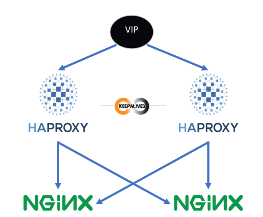

# Table of Contents

1.  [Load Balancing and Failover Project with Docker Compose](#orge23f11d)
    1.  [Description](#org78619ad)
    2.  [Project Structure](#orgc53a36f)
    3.  [Technologies Used](#org81d4c7d)
        1.  [Docker Compose](#org9c75488)
        2.  [Keepalived](#orgddb179c)
        3.  [HAProxy](#org285d719)
        4.  [Nginx](#org8af1c02)
    4.  [Implementation Choices](#org1268c2c)
        1.  [Failover Strategy](#orga34ec96)
        2.  [Load Balancing](#org9351244)
        3.  [Containerization](#org8cf01ca)
    5.  [Usage](#org63f51ca)
        1.  [Environment](#org18e1c88)
        2.  [Project Setup](#orga443fcf)
        3.  [Testing Failover and Load Balancing](#org5e02eb3)
    6.  [Customization](#org37daf01)
2. [Risposte Del Test](#Risposte)

# Load Balancing and Failover Project with Docker Compose

This project showcases a load balancing and failover implementation using `Docker Compose`, `Keepalived`, and `HAProxy`.

## Description

The purpose of the project is to realize the following network:

The project comprises several Docker containerized services:

-   `keepalived-a` and `keepalived-b`: Two Keepalived instances configured for virtual IP failover.
-   `haproxy-a` and `haproxy-b`: Two HAProxy instances configured for load balancing across web servers.
-   web-a and web-b: Two Nginx (in this case, feel free to put any web serevr) web servers configured to host static content.

## Project Structure

The `docker-compose.yml` file defines the Docker service configuration and associated networks. The main services include:

-   `Keepalived`: Two instances set up to monitor server states and manage the virtual IP for failover.
-   `HAProxy`: Two instances configured to balance traffic load across web servers.
-   `Web Servers`: Two Nginx instances configured to host static content.

Following is the project tree:

    .
    ├── docker-compose.yml
    ├── Dockerfile
    ├── haproxy
    │   └── haproxy.cfg
    ├── keepalived
    │   ├── notify.sh
    │   ├── proxy-a
    │   └── proxy-b
    └── web
        ├── server-a
        └── server-b

## Technologies Used

### Docker Compose

Docker Compose is utilized for defining and running multi-container Docker applications. It simplifies the process of managing multiple interconnected containers.

### Keepalived

Keepalived is used for high availability by providing failover capability with the virtual IP. It ensures continuous service availability by shifting traffic in case of a server failure.

### HAProxy

HAProxy is employed as the load balancer to distribute incoming traffic across multiple web servers. It helps in optimizing resource usage and ensuring high performance by efficiently routing requests.

### Nginx

Nginx serves as the web server to host static content in this setup. It's known for its high performance, stability, and low resource consumption.

## Implementation Choices

### Failover Strategy

Keepalived was chosen due to its simplicity and robustness in managing failover scenarios. It ensures continuous service availability by monitoring server states and diverting traffic when necessary.

### Load Balancing

HAProxy was selected for load balancing because of its efficiency in evenly distributing incoming traffic across multiple servers. This aids in preventing overloading of individual servers and ensures better resource utilization.

### Containerization

Docker was chosen to containerize services for portability, scalability, and ease of deployment. It encapsulates each service, ensuring consistency across different environments.

## Usage

### Environment

For testing purposes and to comply with the configurations without making changes we recommend creating a VM (with hypervisor like VMWare or VirtualBox) in NAT with network 192.168.150.\*

### Project Setup

To start the project, execute the following command in the project's root directory:

    docker-compose up -d

This command initiates all services defined in the docker-compose.yml file in the background.

### Testing Failover and Load Balancing

Access the web servers via the configured virtual IP address (e.g., 192.168.195.150:80).

    ┌──(kali㉿kali)-[~/App/TestCLE]
    └─$ curl http://192.168.195.150
    Server A
    
    ┌──(kali㉿kali)-[~/App/TestCLE]
    └─$ curl http://192.168.195.150
    Server B

Test the system's resilience by simulating the loss of a web server or HAProxy instances stopping them.

# Risposte

Possiamo osservare che all'interno della sezione __"services"__ vengono istaziati quattro servizi i primi due sono i __"web_server"__ (Nginx), prendono il loro codice dal loro relativo dockerfile che a sua volta punta al file __"nginx.conf"__   

Risposta 1:

_Implementare la cache su webserver o sul load balancer dipende molto dall'infrastruttura di rete però utilizzerei come primo metro di scelta la potenza di calcolo, in base a chi ne ha di più implementerei la funzione di caching o sul load balancer o sul webserver. Altra metrica sarebbe basato su come è organizzato il sito che serviamo infatti se abbiamo un'alta presenza di pagine statiche affiderei il caching al load balancer invece se abbiamo diverse pagine dinamiche implementiamo il caching verso i webserver._

Risposta 2:

_Le componenti che avrei conteinerizzato sono i 2 webserver per fattori di sicurezza infatti avrei un ambiente isolato, velocità di building data dal docker, gestione semplificata delle dipendeze e delle configurazioni in quanto con un file docker posso impostare il tutto_

Risposta 3:

_Nell'architettura implementata assegnerei il virtual IP ai load balancer, in quanto gestirà il traffico e il tutto verrà ridistributo ai vari webservers inoltre in caso che uno dei Haproxy muoia abbiamo a disposizione il rimanente che gestirà il resto_

Risposta 4:

_Le vulnerabilità che possiamo riscontrare e le relative mitigazioni sono:_

- Request smuggling = tenere sempre aggiornati alle versioni più recenti i proxy

- Accesso non autorizzato = implementare gli accessi tramite SSH (con fail2ban) e whitlistare gli ip che possono connettersi 

- XSS, SQLI, ecc... = un WAF da mettere davanti i load balancer che filtri le richieste a livello 7

- Attacchi DDoS = firewall che filtri il traffico di rete

- Modifica dei filesystem tramite accessi non autorizzati = implementare una soluzione open-source come tripwire che permette di controllare se vi sono cambiamenti nei filesystems

Risposta 5:

_Le metriche che monitorerei per valutare le prestazioni dei load balancer sono:_

1) Connessioni attive: capire quante connessioni attive ci sono e come sono ditribuite tra i vari webserver

2) Latenza: il tempo impiegato per servire la pagina richiesta

3) Connessioni fallite: capire quante connessioni falliscono e specialmente i motivi per cui falliscono

4) Risorse utilizzate: valutare quante risorve vengono consumate da essi

5) Throughput: vedere la capacità massima del load balancer ci permette di capire il carico massimo che può sopportare

## Customization

Tailor the project by adjusting configurations specific to each service in their respective configuration files.

A thank you to the creators of this project:

-   [@Disturbante](https://github.com/Disturbante)
-   [@AleHelp](https://github.com/AleHelp)
-   [@MattiaCossu](https://github.com/MattiaCossu)

